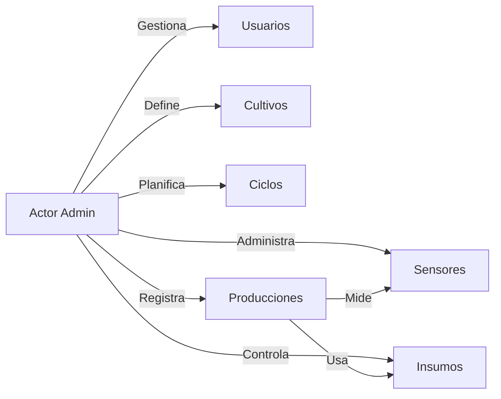
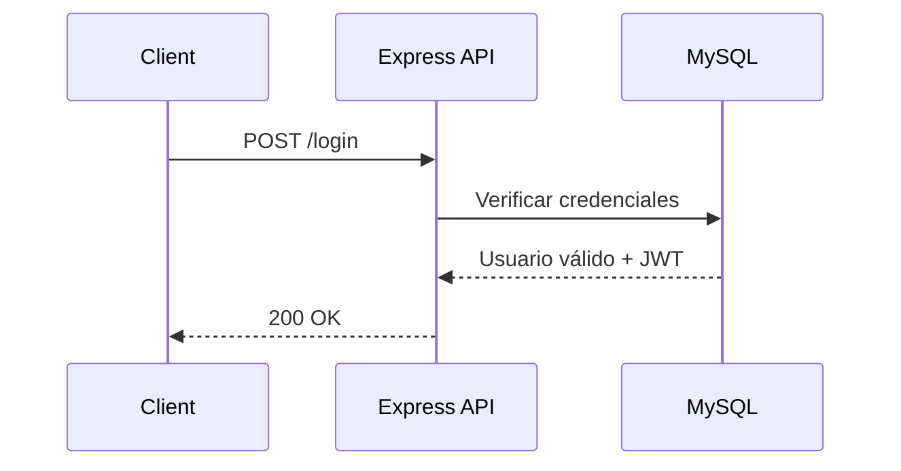
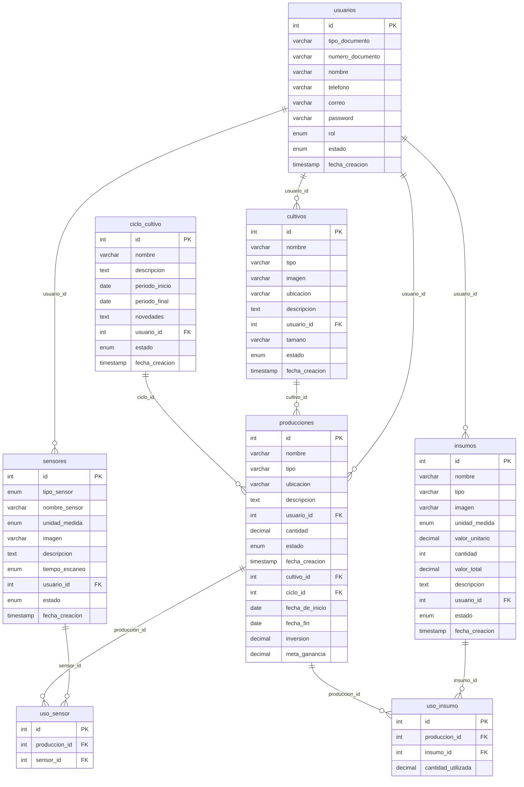

## Portada

**Sistema de Gestión Agrícola (SGA)**

Informe administrativo del repositorio

Autoría del repositorio (Git):

- stefanny834 <skaylopez2904@gmail.com> (28 commits)
- MateoGr <mateogr72@gmail.com> (9 commits)
- stephanny13 <stephannycruzzuluaga@gmail.com> (2 commits)
- Cursor Agent <cursoragent@cursor.com> (1 commit)
- Mateo M <mateogr72@gmail.com> (1 commit)

## Contraportada

Proyecto: Sistema de Gestión Agrícola

Repositorio remoto: origin `https://github.com/BoTeoGr/lembo_sgl_skm` (según configuración actual)

Licencia: ISC

Versión del proyecto: 2.5.0

## Tabla de Contenido

1. Portada
2. Contraportada
3. Tabla de Contenido
4. Lista de Diagramas
5. Lista de Ilustraciones
6. Lista de Tablas
7. Introducción
8. Objetivo General del informe
9. Objetivos Específicos del informe
10. Planteamiento del problema
11. Justificación
12. Impacto del proyecto
13. Personas involucradas
14. Descripción general del sistema
15. Tareas asignadas al grupo de trabajo
16. Cronograma de trabajo (Roles y Horas)
17. Requerimientos del sistema
18. Técnicas de recolección
19. Mapa de procesos y ficha de procesos
20. Diagramas UML
21. Modelo Entidad/Relación
22. Mapa de Navegación

## Lista de Diagramas

- ERD (Mermaid) generado a partir del esquema SQL
- Diagrama de Navegación (Mermaid)
- UML (Casos de Uso y Secuencia) propuestos para el backend

## Lista de Ilustraciones

Imágenes encontradas en el repositorio:

- frontend/public/imgs/profile-img.jpg
- frontend/public/imgs/maria.jpeg
- frontend/public/imgs/sgal.jpeg
- frontend/public/imgs/yesenia.jpeg
- frontend/public/imgs/default-cultivo.jpg
- frontend/public/imgs/logoSena.svg
- frontend/public/imgs/img-visualizacion-ciclo-cultivo.png
- frontend/public/imgs/default-avatar.svg
- frontend/public/imgs/carlos.jpeg

## Lista de Tablas

Tablas detectadas en `backend/db/sistema_gestion_agricola.sql`:

- usuarios
- sensores
- insumos
- ciclo_cultivo
- cultivos
- producciones
- uso_insumo
- uso_sensor

## Introducción

Este informe compila la información administrativa del repositorio del Sistema de Gestión Agrícola (SGA), incluyendo contexto del proyecto, participantes, arquitectura, requerimientos y artefactos de modelado.

## Objetivo General del informe

Consolidar en un único documento la visión, alcance, estructura técnica y organizacional del proyecto para su gestión y trazabilidad.

## Objetivos Específicos del informe

- Documentar actores y responsabilidades
- Describir la arquitectura y módulos
- Inventariar tablas, rutas y artefactos
- Proveer diagramas de referencia (ERD, navegación, UML)

## Planteamiento del problema

Las organizaciones agrícolas requieren centralizar la gestión de usuarios, cultivos, insumos, sensores y producciones. La falta de visibilidad y control genera ineficiencias y riesgos operativos.

## Justificación

SGA estandariza procesos clave y facilita la toma de decisiones mediante datos integrados, automatización de tareas y reportes.

## Impacto del proyecto

- Optimización de inventarios e insumos
- Trazabilidad de ciclos y producciones
- Mejora de seguridad y control de accesos
- Base para analítica y proyecciones

## Personas involucradas en el desarrollo del proyecto

Según `package.json` y el historial Git:

- Kevin Acevedo — Autor
- Stephanny Cruz — Autora
- Mateo Mosquera — Autor
- stefanny834 — Contribuyente (28 commits)
- MateoGr — Contribuyente (9 commits)
- stephanny13 — Contribuyente (2 commits)

## Descripción de la generalidad del sistema

Backend Node.js + Express, base de datos MySQL. Módulos principales: usuarios, sensores, insumos, cultivos, ciclo de cultivo, producciones. Exposición de endpoints REST y rutas públicas para widgets.

Rutas principales (`backend/routes/routes.js`): autenticación, CRUD de usuarios, sensores, insumos, cultivos, ciclos y producciones. Rutas públicas para widgets en `/api/widgets/*`.

## Tareas asignadas al grupo de trabajo

- Gestión de autenticación y roles
- Implementación de CRUDs (usuarios, sensores, insumos, cultivos, producciones)
- Integración de resúmenes para widgets públicos
- Modelado y carga de datos SQL

## Cronograma de trabajo (Roles y Horas)

Propuesta base para cierre administrativo:

- Dirección técnica: 40 h
- Backend API y DB: 120 h
- Integración y pruebas: 60 h
- Documentación: 24 h

## Requerimientos del sistema

- Node.js 18+
- MySQL 8+
- Variables de entorno requeridas en `backend/.env`:
  - JWT_SECRET
  - EMAIL_USER
  - EMAIL_PASS
- Dependencias: express, mysql2, bcrypt/bcryptjs, jsonwebtoken, cors, dotenv, nodemailer

## Técnicas de Recolección utilizadas

- Análisis de repositorio y commits
- Revisión de esquema y datos SQL
- Inspección de rutas y controladores

## Mapa de procesos y ficha de procesos

Procesos clave: administración de usuarios y roles; gestión de inventarios (insumos); planificación de cultivos y ciclos; registro de producciones; asociación de sensores e insumos por producción.

Ficha (resumen):

- Proceso: Gestión de Producciones
- Entradas: cultivos, ciclos, insumos, sensores
- Salidas: registros de producción y consumo de insumos
- Indicadores: cantidad, inversión, meta_ganancia, estados

## Diagramas UML





## Modelo Entidad/Relación



## Mapa de Navegación

```mermaid
flowchart TD
    L[Login] --> D[Dashboard]
    D --> U[Usuarios]
    D --> S[Sensores]
    D --> I[Insumos]
    D --> C[Cultivos]
    D --> CC[Ciclos]
    D --> P[Producciones]
    subgraph Widgets Públicos [/api/widgets]
      W1[Supplies]:::w -->|GET /api/widgets/supplies| D
      W2[Sensors]:::w -->|GET /api/widgets/sensors| D
      W3[Crops]:::w -->|GET /api/widgets/crops| D
      W4[Users]:::w -->|GET /api/widgets/users| D
    end
    classDef w fill:#eef,stroke:#88f
```

---

Notas: Este informe fue generado automáticamente a partir del contenido del repositorio a la fecha indicada.

